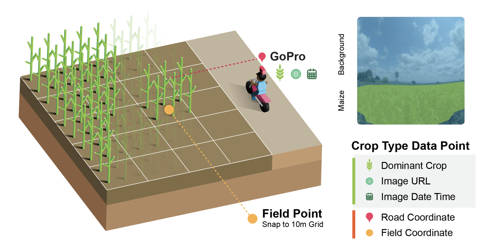

# Helmets Labeling Crops: Kenya

Code for paper: "Helmets Labeling Crops: Kenya Crop Type Dataset Created via Helmet-Mounted Cameras and Deep Learning".

### Repository Structure

`notebooks/` Code for transforming GoPro photos into a crop type dataset. We recommend running each notebook in Google Colab.

`gee/` Code for visualizing and creating a maize map using the crop type dataset. The code can be run on Google Earth Engine by cloning our GEE repository: https://code.earthengine.google.com/?accept_repo=users/izvonkov/helmets-kenya-public

### Crop Type Dataset

