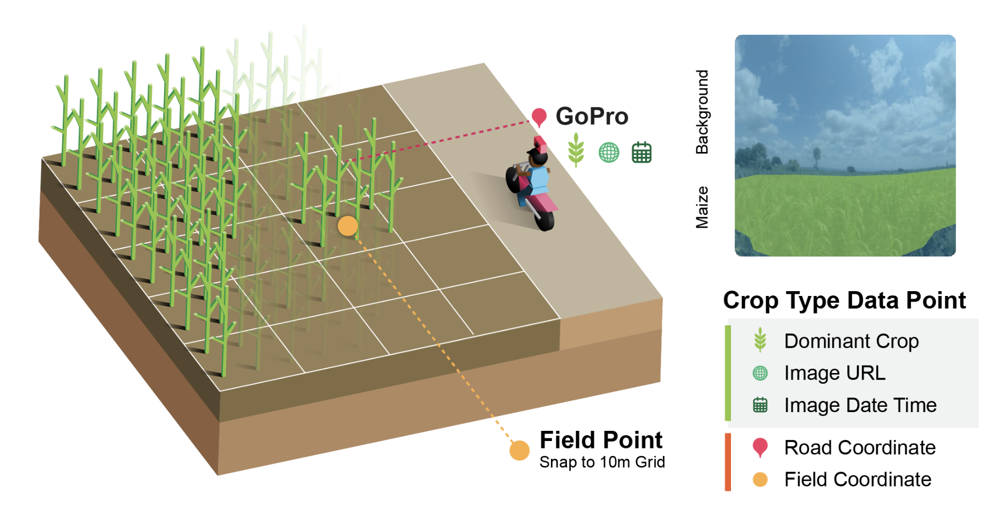

# Helmets Labeling Crops: Kenya

Code for paper: <a href="https://www.nature.com/articles/s41597-025-05762-7">Helmets Labeling Crops: Kenya Crop Type Dataset Created via Helmet-Mounted Cameras and Deep Learning</a>

### Crop Type Dataset

### Pipeline
The pipeline of generating a crop type dataset involves the following steps:
1. GoPros are used for collecting road side images in agricultural zones ([Helmets Data Collection Guide](https://docs.google.com/presentation/d/e/2PACX-1vQpP2f6dAcs_R0yrZ1dOpaKPQab0h-8BBLmwU-1cOfv462l6SMl5ng84A2HjBx4Qw/pub?start=false&loop=false&delayms=60000))
2. Collected photos are uploaded to Cloud Storage ([Instructions for Uploading](https://github.com/nasaharvest/helmets-kenya/blob/main/instructions-for-uploading.md))
3. Photos are processed using our ML models and turned into a Google Earth Pro KMZ file ([notebooks/1_GoPro2CropKMZ.ipynb](https://github.com/nasaharvest/helmets-kenya/blob/main/notebooks/1_GoPro2CropKMZ.ipynb))
4. KMZ file(s) are analyzed to verify model predictions ([Helmets Quality Assessment Instructions](https://docs.google.com/document/d/1OCF2gpCQQbZP-y6xcTbKE2OzhkxMtyaJi8wiWi8jfzs/edit?usp=sharing))
5. Reviewed KMZ files are converted into a csv file ([notebooks/2_CropKMZtoCSV.ipynb](https://github.com/nasaharvest/helmets-kenya/blob/main/notebooks/2_CropKMZtoCSV.ipynb))
6. CSV files are combined into a single Kenya dataset ([notebooks/3_Kenya_dataset_publish.ipynb](https://github.com/nasaharvest/helmets-kenya/blob/main/notebooks/3_Kenya_dataset_publish.ipynb))

### Machine Learning Models
Scripts for training and validating the CropNop and CropSeg model is in the [ML folder](https://github.com/nasaharvest/helmets-kenya/blob/main/ML).

### Working with the points
[Google Earth Engine repository](https://code.earthengine.google.com/?accept_repo=users/izvonkov/helmets-kenya-public)
1. Crop type points visualized in GEE: [gee/1_all_checked_points.js](https://github.com/nasaharvest/helmets-kenya/blob/main/gee/1_all_checked_points.js)
2. Crop type points used for mapping in GEE: [gee/1_all_checked_points.js](https://github.com/nasaharvest/helmets-kenya/blob/main/gee/2_Nakuru_maize_map.js)

